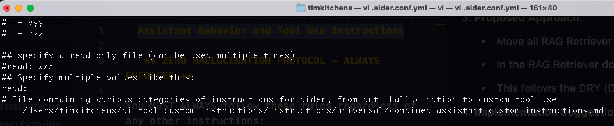

# Setting Up AI Coding Assistants with Custom Instructions

This guide walks you through setting up various AI coding assistants to use our custom instructions and tools.

## Prerequisites

Before configuring your AI coding assistant, you'll need to:

1. Clone this repository:

```bash
git clone https://github.com/codingthefuturewithai/ai-assistant-instructions.git
```

2. Install the required tools by following the installation instructions in their respective repositories:
   - [RAG Retriever](https://github.com/codingthefuturewithai/rag-retriever)
   - [Conduit](https://github.com/codingthefuturewithai/conduit)

## Configuring AI Coding Assistants

Choose your preferred AI coding assistant below and follow the setup instructions.

### Configuring Aider

1. Create or edit `.aider.conf.yml` in your home directory (`~/`).
2. Add the following entry to the `read` section, replacing the path with your actual clone location:

```yaml
read:
  # File containing various categories of instructions for aider, from anti-hallucination to custom tool use
  - /path/to/your/clone/ai-assistant-instructions/instructions/universal/combined-assistant-custom-instructions.md
```

For more details about the configuration file format and other options, see the [Aider Configuration Documentation](https://aider.chat/docs/config/aider_conf.html#sample-yaml-config-file).



### Configuring Cursor

1. Open Cursor IDE
2. Open Command Palette (Shift+Cmd+P)
3. Select "Cursor Settings"
4. Click on "General" in the left sidebar
5. In the AI Rules section, paste the contents of [`combined-assistant-custom-instructions.md`](../universal/combined-assistant-custom-instructions.md)
6. Click Save to apply the changes


### Configuring Windsurf

1. Open Windsurf IDE
2. Click on "Windsurf - Settings" in the bottom navigation bar
3. Navigate to "Set Global AI Rules" and click "Edit Rules"
4. Paste the contents of [`combined-assistant-custom-instructions.md`](../universal/combined-assistant-custom-instructions.md)
5. Save your changes


## Verification

After configuring your chosen AI coding assistant, you can verify the setup by:

1. Starting a new chat session
2. Testing the assistant with these specific queries:
   - "What tools are available to me?"
   - "Show me examples of how to use these tools"
   - "What can I do with the RAG Retriever tool?"
   - "What are the available Conduit commands?"
3. Confirming that:

   - The assistant lists both the RAG Retriever and Conduit tools
   - It provides detailed command examples for each tool
   - It demonstrates understanding of tool capabilities and limitations

4. Testing the Zero Hallucination Protocol:
   - Try this query: "How do I use version 99.9.9 of the RAG Retriever?"
   - The assistant should refuse to proceed and respond with something like:
     ```
     I cannot proceed as I don't have confirmed knowledge of RAG Retriever version 99.9.9. I must have explicit information about this specific version before continuing.
     ```
   - If the assistant tries to guess or make assumptions about this non-existent version, the protocol is not working correctly

## Troubleshooting

If the AI assistant doesn't acknowledge the custom instructions:

1. Double-check the file paths and make sure they're correct for your system
2. Ensure you've copied the complete contents of the instructions file
3. Restart your IDE/assistant after making configuration changes
4. Check that you have the required permissions to access the instruction files

## Support

If you encounter any issues, please:

1. Visit our [GitHub Issues](https://github.com/codingthefuturewithai/ai-assistant-instructions/issues) page
2. Create a new issue if your problem hasn't been reported
3. Include your configuration details and any error messages when reporting issues
